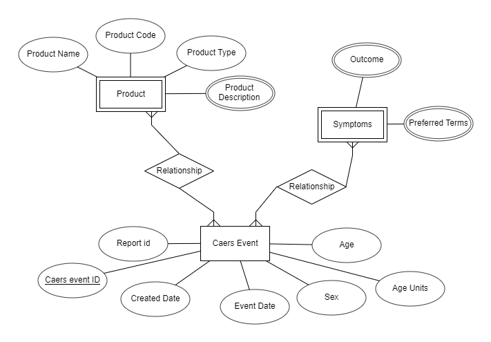

# CFSAN Adverse Event Reporting System (CAERS) Project

### A project analyzing adverse events, the symptoms, and the culprit products from CFSAN's Adverse Event Reporting System or also known as CAERS.

## ER Diagram
- An ER diagram showcasing the relationships between each entity.

